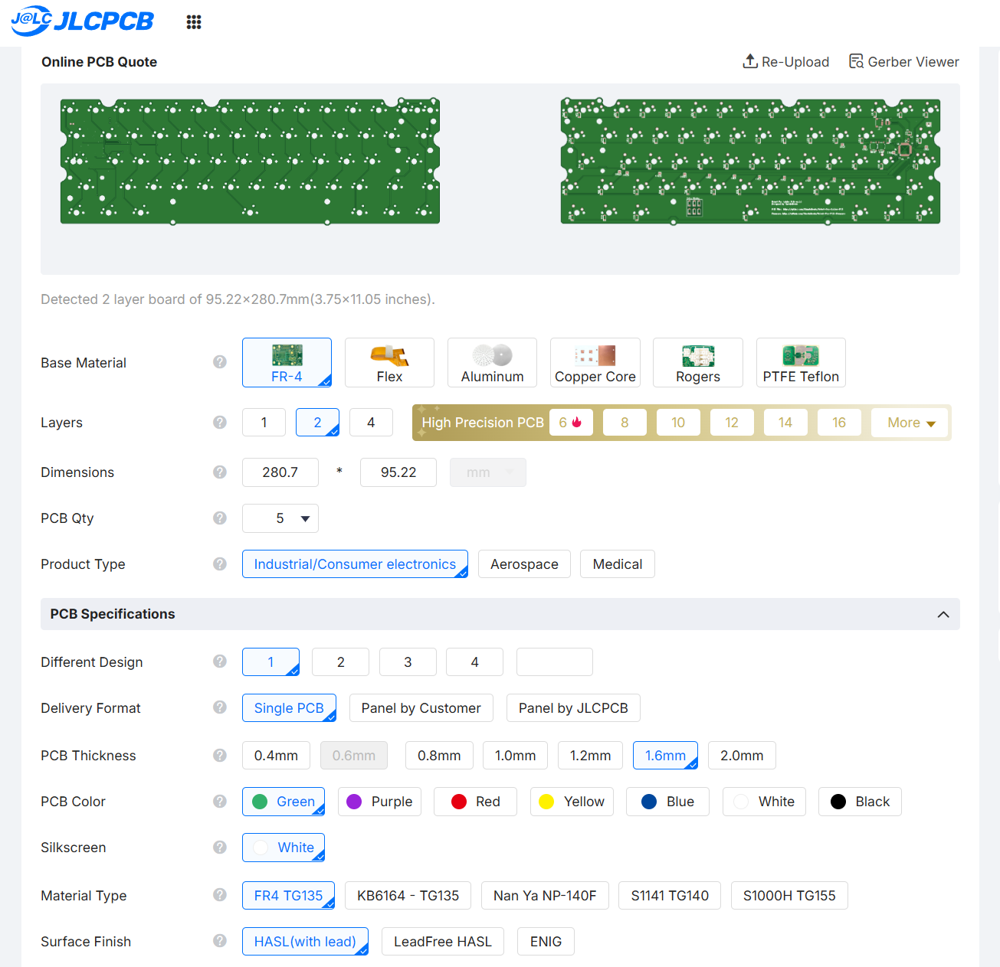
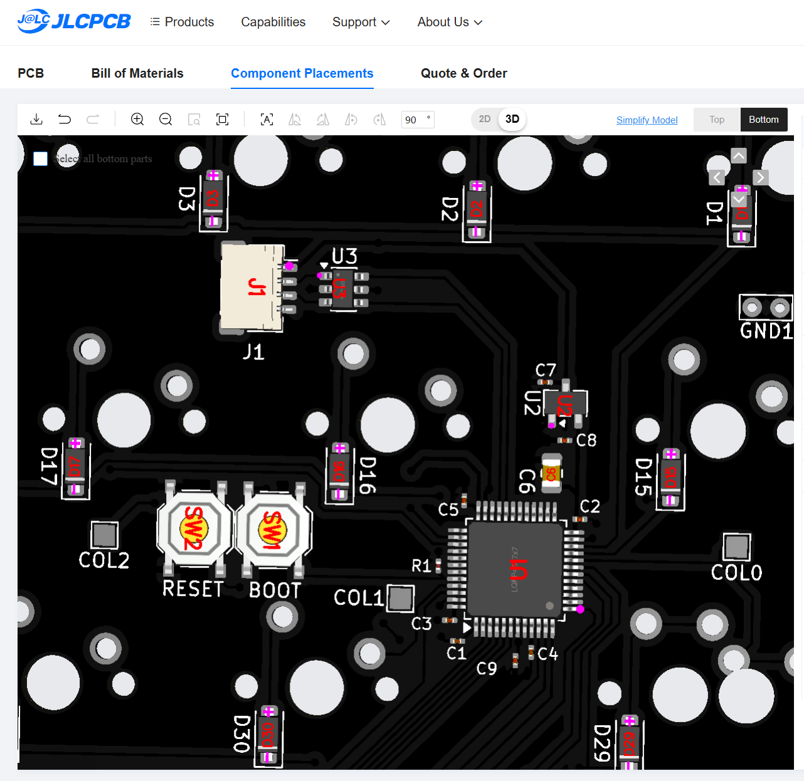
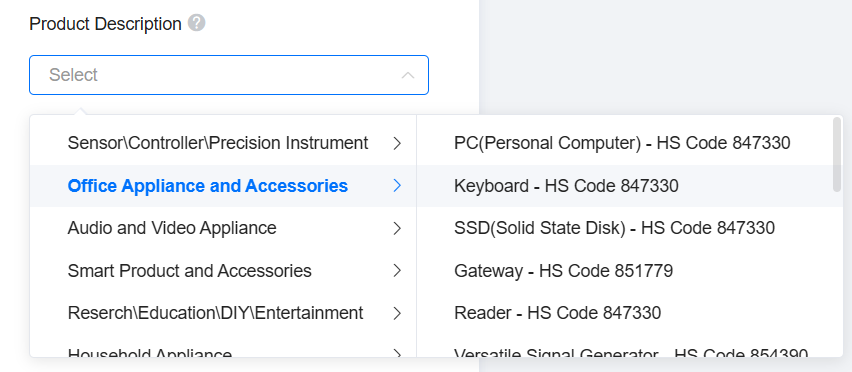

# How to order this PCB from JLCPCB

You do **not** need KiCad for this. Everything you need is in
`VP_Solder_KiCad/production/`.

---

## What you need

| File | What it's for |
|---|---|
| `VP_Solder.zip` | The board itself. Required. |
| `bom.csv` | Which parts to solder on. Only needed for assembly. |
| `positions.csv` | Where those parts go. Only needed for assembly. |

---

## Ordering from JLCPCB with Assembly

**Estimated Costs:** $20-30/PCB shipped to US (tariffs included)
**Fullfillment Time:** Around 2-3 weeks

1. Go to [jlcpcb.com](https://jlcpcb.com), click order, and then **Add gerber file**.
2. Upload `VP_Solder.zip`.
3. Wait for the preview to load, then check it against the images in this
   repo's README. The board outline should match.
4. Leave the defaults alone unless you want a specific colour. The defaults
   (1.6mm thickness, HASL, 2 layers, FR4) are correct for this board. 1.2mm
   also works but you will need stabilizer shims. Don't change anything in the
   **High-Spec Options** section.
5. Toggle **PCB Assembly** on.
6. Choose **Assemble bottom side** — all components on this board are on the bottom.
   You will need to choose the **Standard** PCBA option, keep other options as default
   (Parts Selection by customer, OPTIONAL: Confirm parts placement).
7. CLick **Save to Cart** and you will see a preview of the PCB, click next, and
   upload `bom.csv` when asked for the BOM and `positions.csv` when asked for the
   CPL / pick-and-place file. Then click **Process BOM & CPL**.
8. JLCPCB will attempt to match your parts from the BOM to parts in stock. Some parts
   will be unmatched. Check each part to match to the JLC part in this table:

| Designators | Value | Package | JLCPCB part ID | Alternative JLCPCB Part ID's |
| --- | --- | --- | --- | --- |
| C1–C5, C9 | 100 nF | 0201 | C76934 | C76938, C66938, C76928, C49062 |
| C6 | 10 µF | 0805 | C440198 | C15850, C1713, C40894 |
| C7, C8 | 1 µF | 0201 | C76935 | C53067, C87143, C76930 |
| D1–D62 | 1N4148W | **SOD-123** | C81598 | C84367, C83528 |
| R1 | 10 kΩ | 0201 | C7467266 | C106225, C138117, C102684 |
| U1 | STM32F072CBT6 | LQFP-48 | C81720 | - |
| U2 | XC6206P332MR | SOT-23-3 | C5446 | - |
| U3 | USBLC6-2SC6 | SOT-23-6 | C2827654 | - |
| SW1, SW2 | TS-1187A-B-A-B | SMD tactile | C318884 | - |
| J1 | SM04B-SRSS-TB | JST SH 4-pin | C160404 | - |

**Please note:**
- The MCU uses the **CB** variant **STM32F072CBT6** (128 KB flash), not C8
(64 KB).
- Leave Test points and GND1 as unmatched.
- Some parts in this table might be out of stock when you check.
  Just choose from the alternative column.

9. After clicking **Next** you are then asked to confirm component placements.
   Sometimes JLC will incorrectly rotate a part, so this is an important step.
   Review the component placement preview. Check that the diodes' positive end
   faces UP. Make sure each components' purple dot is lined up with the triangle
   on the pcb. Make sure to verify **U2** is in the correct orientation, JLC
   likes flipping that one 90 degrees. As you can see here, U1 is in the incorrect orientation:

10. At the last stage, set your product description as **Office Applicance and Accessories** -> **Keyboard HS Code 847330**

   
## After it arrives

Flash the firmware:
https://github.com/ShentoBento/Velvet-Pro-PCB-Firmware
